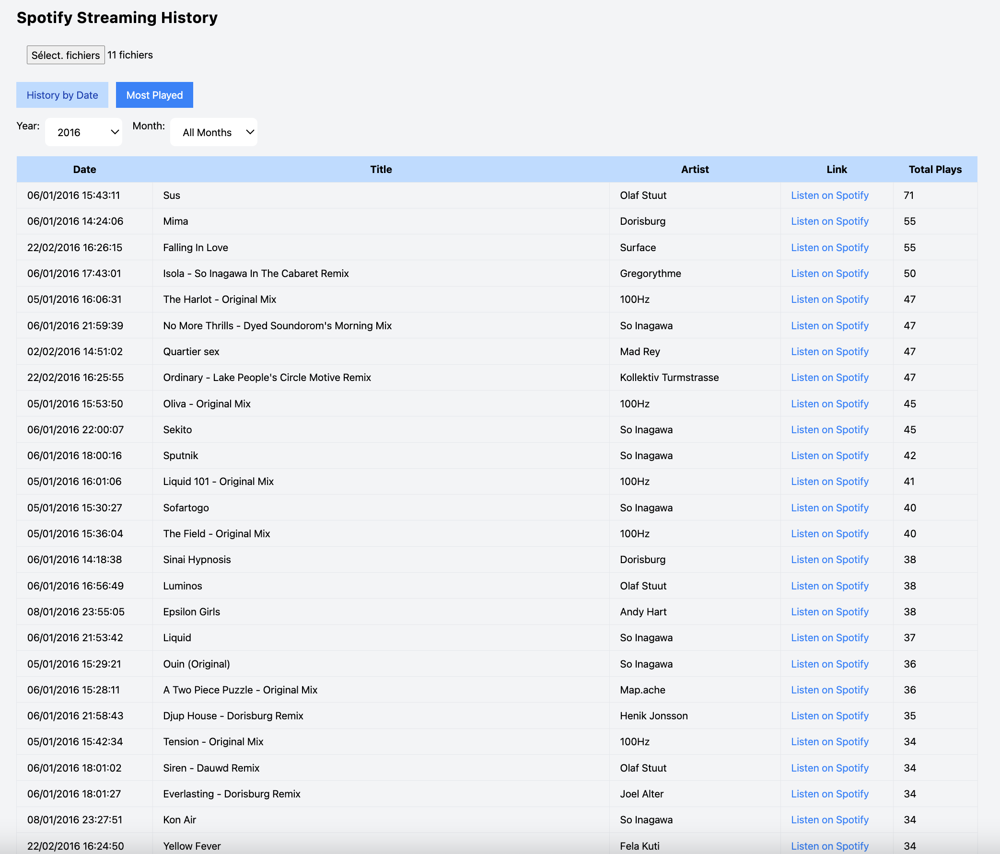

# Spotify Streaming History Analyzer

## About the Project
The Spotify Streaming History Analyzer is a JavaScript tool designed to dive deep into your Spotify listening history, far beyond the annual Wrapped recap. It lets you explore your musical journey over the years, rediscover forgotten tracks, and see how your tastes have evolved. With this script, you can sort your listening history by year, by month, and even get direct links to replay your favorite songs instantly.

## Features
- **Detailed History**: Access your complete Spotify listening history.
- **Sorting Options**: Filter your music by year and month for targeted nostalgia.
- **Direct Play Links**: Jump right back into your favorite tunes with direct links.
- **Nostalgic Journey**: Rediscover songs and artists you loved in the past.

## How It Works
1. **Get Your Spotify Data**:
   - Visit Spotify's Privacy page [here](https://www.spotify.com/fr/account/privacy/).
   - Request to download your data. It might take a few days, but you'll receive a zip file with your complete listening history.

2. **Set Up the Script**:
  - Clone this repository.
  - Store your downloaded Spotify JSON files in a specific folder.
  - Execute the .html script to process and visualize your history along with the chosen JSON files.

## Visual Guide

*An example of the Spotify Streaming History Analyzer in action.*

